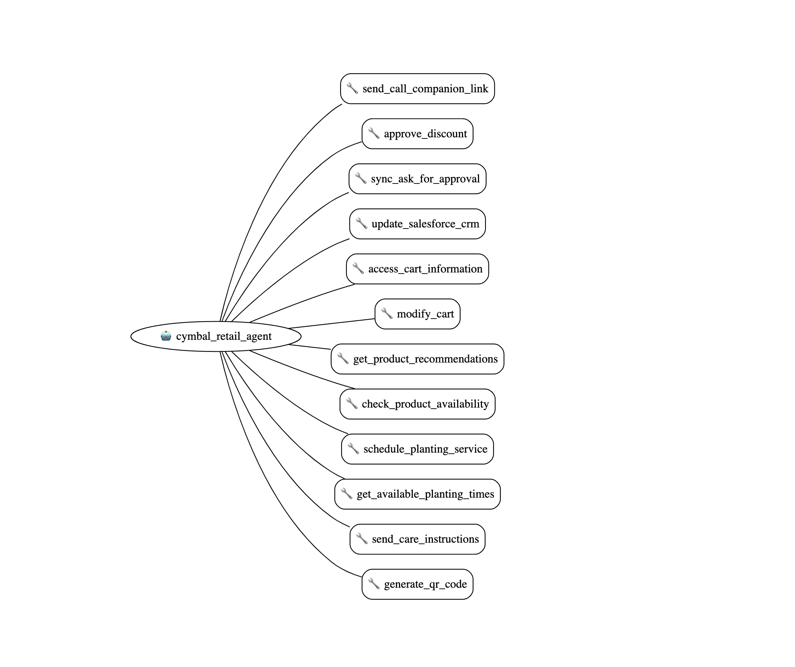

# Elite Beauty Clinic AI Customer Service Agent

> **🚫 CRITICAL WARNING: NOT FOR COMMERCIAL USE 🚫**
> 
> **⚠️ PROTOTYPE ONLY** - 이 코드는 데모/학습 목적의 프로토타입입니다  
> **❌ 상용 서비스 배포 금지** - 현재 상태로는 실제 서비스에 사용할 수 없습니다  
> **🔒 보안 미구현** - 인증, 암호화, API 보안 등 상용 보안 기능 없음  
> **⚡ 성능 미최적화** - 대용량 트래픽, 확장성, 모니터링 지원 없음  
> **📊 로깅 기본 수준** - 상용 서비스 수준의 로깅, 추적, 에러 처리 없음
> 
> 📋 **상용화 로드맵**: [PRODUCTION_TODO.md](./PRODUCTION_TODO.md) - 16-22주 개발 필요

이 프로젝트는 뷰티 클리닉을 위한 AI 기반 고객 서비스 에이전트의 **프로토타입**입니다. 고객 상담, 시술 추천, 예약 관리, 개인화된 서비스 제공을 위해 설계되었습니다.

## Overview

The Cymbal Home & Garden Customer Service Agent is designed to provide a seamless and personalized shopping experience for customers. It leverages Gemini to understand customer needs, offer tailored product recommendations, manage orders, and schedule services. The agent is designed to be friendly, empathetic, and highly efficient, ensuring that customers receive the best possible service.

## Agent Details

The key features of the Customer Service Agent include:

| Feature            | Description             |
| ------------------ | ----------------------- |
| _Interaction Type_ | Conversational          |
| _Complexity_       | Intermediate            |
| _Agent Type_       | Single Agent            |
| _Components_       | Tools, Multimodal, Live |
| _Vertical_         | Retail                  |

### Agent Architecture



The agent is built using a multi-modal architecture, combining text and video inputs to provide a rich and interactive experience. It mocks interactions with various tools and services, including a product catalog, inventory management, order processing, and appointment scheduling systems. The agent also utilizes a session management system to maintain context across interactions and personalize the customer experience.

## 🚨 **CRITICAL LIMITATIONS - 상용 서비스 불가 사유**

### ❌ **Mock 구현 - 실제 백엔드 연동 없음**
- **모든 데이터가 하드코딩됨**: 고객 정보, 예약, 장바구니 등
- **변경사항 지속되지 않음**: 장바구니 추가 후 다시 조회하면 원래 상태로 복원
- **실제 서비스 불가**: SMS 발송, 결제 처리, 예약 확정 등 모두 Mock
- **데이터베이스 없음**: PostgreSQL/MySQL 등 실제 DB 연동 필요

### ❌ **보안 시스템 완전 미구현 - 해킹 위험 높음**
- **인증/인가 시스템 없음**: 누구나 모든 기능 접근 가능
- **API 보안 미구현**: API 키, JWT 토큰, OAuth 등 없음
- **데이터 암호화 없음**: 개인정보, 결제 정보 암호화 안됨
- **SQL 인젝션 취약**: 입력값 검증/필터링 없음
- **HTTPS 미설정**: 데이터 전송 중 노출 위험

### ❌ **성능 및 확장성 미최적화 - 서비스 장애 위험**
- **동접자 제한**: 10명 이상 접속 시 서버 다운 위험
- **메모리 누수**: 장시간 운영 시 메모리 부족
- **캐싱 없음**: Redis 등 캐시 시스템 미구현
- **로드 밸런싱 없음**: 트래픽 분산 불가
- **CDN 없음**: 이미지/정적 파일 로딩 느림

### ❌ **로깅 및 모니터링 기본 수준 - 장애 대응 불가**
- **에러 추적 불가**: 실시간 에러 모니터링 없음
- **성능 지표 없음**: 응답 시간, 처리량 측정 안됨
- **사용자 행동 분석 없음**: 비즈니스 인사이트 수집 불가
- **백업/복구 없음**: 데이터 손실 시 복구 불가
- **로그 보관 정책 없음**: GDPR/개인정보보호법 미준수

### ✅ **실제 백엔드 연동을 위해서는**
`customer_service/tools.py` 파일의 모든 함수를 실제 API 호출로 교체해야 합니다.

**예시:**
```python
# 현재 (Mock)
def access_cart_information(customer_id: str) -> dict:
    return {"items": [...], "subtotal": 430000}  # 하드코딩

# 필요 (실제 구현)
def access_cart_information(customer_id: str) -> dict:
    response = requests.get(f"{API_BASE_URL}/customers/{customer_id}/cart")
    return response.json()
```

### Key Features

- **Personalized Customer Assistance:**
  - Greets returning customers by name and acknowledges their purchase history.
  - Maintains a friendly, empathetic, and helpful tone.
- **Product Identification and Recommendation:**
  - Assists customers in identifying plants, even from vague descriptions.
  - Requests and utilizes visual aids (video) to accurately identify plants.
  - Provides tailored product recommendations based on identified plants, customer needs, and location (e.g., Las Vegas, NV).
  - Offers alternatives to items in the customer's cart if better options exist.
- **Order Management:**
  - Accesses and displays the contents of a customer's shopping cart.
  - Modifies the cart by adding and removing items based on recommendations and customer approval.
  - Informs customers about relevant sales and promotions.
- **Upselling and Service Promotion:**
  - Suggests relevant services, such as professional planting services.
  - Handles inquiries about pricing and discounts, including competitor offers.
  - Requests manager approval for discounts when necessary.
- **Appointment Scheduling:**
  - Schedules appointments for planting services (or other services).
  - Checks available time slots and presents them to the customer.
  - Confirms appointment details and sends a confirmation/calendar invite.
- **Customer Support and Engagement:**
  - Sends via sms or email plant care instructions relevant to the customer's purchases and location.
  - Offers a discount QR code for future in-store purchases to loyal customers.
- **Tool-Based Interactions:**
  - The agent interacts with the user using a set of tools.
  - The agent can use multiple tools in a single interaction.
  - The agent can use the tools to get information and to modify the user's transaction state.
- **Evaluation:**
  - The agent can be evaluated using a set of test cases.
  - The evaluation is based on the agent's ability to use the tools and to respond to the user's requests.

#### Agent State - Default customer information

The agent's session state is preloaded with sample customer data, simulating a real conversation. Ideally, this state should be loaded from a CRM system at the start of the conversation, using the user's information. This assumes that either the agent authenticates the user or the user is already logged in. If this behavior is expected to be modified edit the [get_customer(current_customer_id: str) in customer.py](./customer_service/entities/customer.py)

#### Tools

The agent has access to the following tools:

- `send_call_companion_link(phone_number: str) -> str`: Sends a link for video connection.
- `approve_discount(type: str, value: float, reason: str) -> str`: Approves a discount (within pre-defined limits).
- `sync_ask_for_approval(type: str, value: float, reason: str) -> str`: Requests discount approval from a manager.
- `update_salesforce_crm(customer_id: str, details: str) -> dict`: Updates customer records in Salesforce.
- `access_cart_information(customer_id: str) -> dict`: Retrieves the customer's cart contents.
- `modify_cart(customer_id: str, items_to_add: list, items_to_remove: list) -> dict`: Updates the customer's cart.
- `get_product_recommendations(plant_type: str, customer_id: str) -> dict`: Suggests suitable products.
- `check_product_availability(product_id: str, store_id: str) -> dict`: Checks product stock.
- `schedule_planting_service(customer_id: str, date: str, time_range: str, details: str) -> dict`: Books a planting service appointment.
- `get_available_planting_times(date: str) -> list`: Retrieves available time slots.
- `send_care_instructions(customer_id: str, plant_type: str, delivery_method: str) -> dict`: Sends plant care information.
- `generate_qr_code(customer_id: str, discount_value: float, discount_type: str, expiration_days: int) -> dict`: Creates a discount QR code.

## Setup and Installations

### Prerequisites

- Python 3.11+
- Node.js 16+ (for TypeScript/Jest tests)  
- Poetry (for dependency management) - 선택사항
- Google ADK SDK (installed via Poetry) - 선택사항 (Mock 시스템 지원)
- Google Cloud Project (for Vertex AI Gemini integration) - 선택사항

### Quick Setup (개발자 없이도 가능)

**자동 설치 스크립트 사용:**
```bash
# macOS/Linux
./setup_development.sh

# Windows
setup_development.bat
```

**수동 설치:**
```bash
# Python 의존성 설치
pip3 install -r requirements.txt

# Node.js 의존성 설치  
npm install

# 테스트 실행
python3 -m pytest tests/unit/ -v  # Python 테스트
npm test                           # TypeScript 테스트
```

### Installation
1.  **Prerequisites:**

    For the Agent Engine deployment steps, you will need
    a Google Cloud Project. Once you have created your project,
    [install the Google Cloud SDK](https://cloud.google.com/sdk/docs/install).
    Then run the following command to authenticate with your project:
    ```bash
    gcloud auth login
    ```
    You also need to enable certain APIs. Run the following command to enable
    the required APIs:
    ```bash
    gcloud services enable aiplatform.googleapis.com
    ```

1.  Clone the repository:

    ```bash
    git clone https://github.com/google/adk-samples.git
    cd adk-samples/agents/customer-service
    ```

    For the rest of this tutorial **ensure you remain in the `agents/customer-service` directory**.

2.  Install dependencies using Poetry:

- if you have not installed poetry before then run `pip install poetry` first. then you can create your virtual environment and install all dependencies using:

  ```bash
  poetry install
  ```

  To activate the virtual environment run:

  ```bash
  poetry env activate
  ```

3.  Set up Google Cloud credentials:

    - Ensure you have a Google Cloud project.
    - Make sure you have the Vertex AI API enabled in your project.
    - Set the `GOOGLE_GENAI_USE_VERTEXAI`, `GOOGLE_CLOUD_PROJECT`, and `GOOGLE_CLOUD_LOCATION` environment variables. You can set them in your `.env` file (modify and rename .env_sample file to .env) or directly in your shell. Alternatively you can edit [customer_service/config.py](./customer_service/config.py)

    ```bash
    export GOOGLE_CLOUD_PROJECT=YOUR_PROJECT_NAME_HERE
    export GOOGLE_GENAI_USE_VERTEXAI=1
    export GOOGLE_CLOUD_LOCATION=us-central1
    ```

## Running the Agent

You can run the agent using the ADK commant in your terminal.
from the root project directory:

1.  Run agent in CLI:

    ```bash
    adk run customer_service
    ```

2.  Run agent with ADK Web UI:
    ```bash
    adk web
    ```
    Select the customer_service from the dropdown

### Example Interaction

Here's a quick example of how a user might interact with the agent:

**User:**:
hi there

**Agent**:
Hey Alex, I see you've been a Cymbal Home & Garden customer for a couple of years now - we appreciate your business! I also see you have a few things in your cart already. How can I help you get your garden growing today?

**User**:
Yeah, so I'm a bit confused. I just bought some...uh...plants or flowers that I wanted to put in the backyard. They just say "sun loving annuals" on them. I totally spaced on picking up potting soil so I'm placing an order for pickup now. The problem is, I'm not sure if the potting soil and fertilizer I picked out are the right ones.

**Agent**:
I understand – it can be tricky when you're not quite sure what you've got! Let's figure this out together. Don't worry, we'll get your plants the right care. To best help you, would you be willing to share a quick video of the plants you've purchased? That will help me identify them and make sure you have the right supplies.

**User**:
Sure, how do I do that?

**Agent**:
I just texted you a link to the number in your profile. Just click on that, and it'll open a secure video connection.

```tool_code
print(send_call_companion_link(phone_number='+12065550123'))
```

```tool_outputs
{'status': 'success', 'message': 'Link sent to +12065550123'}
```

**User**:
Okay, I clicked the link...can you see this?

**Agent**:
Yes I can see you Alex! Can you go ahead and point the camera at your plants so I can inspect them?

**User**:
Yes of course!
...

## Evaluating the Agent

Evaluation tests assess the overall performance and capabilities of the agent in a holistic manner.

**Steps:**

1.  **Run Evaluation Tests:**

    ```bash
    pytest eval
    ```

    - This command executes all test files within the `eval` directory.

## Unit Tests

Unit tests focus on testing individual units or components of the code in isolation.

**Steps:**

1.  **Run Unit Tests:**

    ```bash
    pytest tests/unit
    ```

    - This command executes all test files within the `tests/unit` directory.

## Configuration

You can find further configuration parameters in [customer_service/config.py](./customer_service/config.py). This incudes parameters such as agent name, app name and llm model used by the agent.

## Deployment on Google Agent Engine

In order to inherit all dependencies of your agent you can build the wheel file of the agent and run the deployment.

1.  **Build Customer Service Agent WHL file**

    ```bash
    poetry build --format=wheel --output=deployment
    ```

1.  **Deploy the agent to agents engine**
    It is important to run deploy.py from within deployment folder so paths are correct

    ```bash
    cd deployment
    python deploy.py
    ```

### Testing deployment

This code snippet is an example of how to test the deployed agent.

```
import vertexai
from customer_service.config import Config
from vertexai.preview.reasoning_engines import AdkApp


configs = Config()

vertexai.init(
    project="<GOOGLE_CLOUD_LOCATION_PROJECT_ID>",
    location="<GOOGLE_CLOUD_LOCATION>"
)

# get the agent based on resource id
agent_engine = vertexai.agent_engines.get('DEPLOYMENT_RESOURCE_NAME') # looks like this projects/PROJECT_ID/locations/LOCATION/reasoningEngines/REASONING_ENGINE_ID

for event in remote_agent.stream_query(
    user_id=USER_ID,
    session_id=session["id"],
    message="Hello!",
):
    print(event)

```

## ⚠️ DISCLAIMER - 면책 조항

**🚫 상용 서비스 배포 절대 금지**

이 에이전트 샘플은 **학습 및 데모 목적으로만** 제공되며, **상용 서비스에서의 사용은 절대 금지**됩니다. 이 코드는 에이전트 개발의 기초적인 예시이며, 개발자나 팀이 자체 에이전트를 개발하기 위한 출발점으로만 사용되어야 합니다.

**⚠️ 상용 서비스 위험 경고:**
- **보안 취약점**: 해킹, 데이터 유출, 개인정보 노출 위험 매우 높음
- **서비스 장애**: 트래픽 증가 시 서버 다운, 데이터 손실 위험
- **법적 책임**: 개인정보보호법, 전자상거래법 등 법규 위반 위험
- **금전적 손실**: 고객 불만, 배상책임, 비즈니스 신뢰도 손상

**개발 요구사항:**
이 샘플은 엄격한 테스트를 거치지 않았으며, 버그나 제한사항을 포함할 수 있습니다. 상용 환경에 필요한 다음 기능들이 누락되어 있습니다:
- 강력한 에러 처리 및 복구 시스템
- 엔터프라이즈급 보안 조치 (인증, 암호화, 접근 제어)
- 확장성 및 고가용성 아키텍처
- 성능 최적화 및 모니터링
- 포괄적인 로깅 및 감사 추적
- 고급 설정 옵션 및 관리 도구

**법적 면책:**
사용자는 이 샘플을 기반으로 한 모든 추가 개발, 테스트, 보안 강화 및 배포에 대한 전적인 책임을 집니다. 라이브 또는 중요한 시스템에서 파생된 에이전트를 사용하기 전에 철저한 검토, 테스트 및 적절한 보안 조치 구현을 강력히 권장합니다.

**💡 권장사항**: 상용 서비스 개발을 원한다면 [PRODUCTION_TODO.md](./PRODUCTION_TODO.md)의 16-22주 개발 로드맵을 따라 전문 개발팀과 함께 진행하시기 바랍니다.

## 환경 설정 (Customer Service)

`customer_service` 모듈을 사용하기 전에 프로젝트 루트 디렉토리의 `.env` 파일에 다음 환경변수를 설정해주세요:

- `USE_MOCK_DATA`: `true`로 설정하면 Mock 데이터를 사용하고, `false`로 설정하면 실제 데이터베이스에 연결합니다. (기본값: `false` 권장)
  ```env
  # .env 파일 예시
  USE_MOCK_DATA=false
  ```